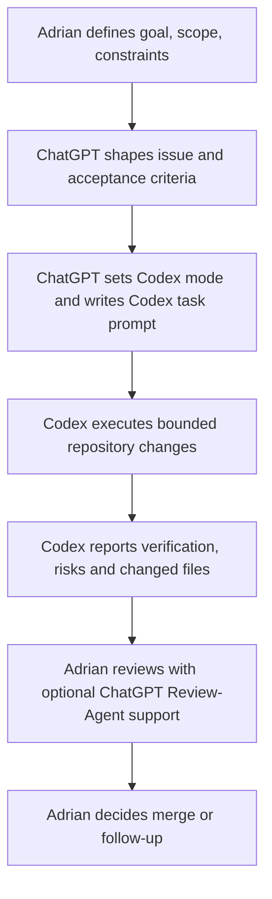

# Parqet App

Parqet App is a Next.js application for working with authorized Parqet portfolio data. The repository has completed the Phase 0 / Phase 0.1 collaboration and governance baseline and is now working through Phase 1 UI foundation and Phase 2 pipeline-readiness decisions before further data-pipeline migration.

English is the source of truth for repository documentation. German translations may exist as placeholders until a later Translation-Agent PR provides full translations.

## Current Scope

The app already contains Parqet OAuth routes, dashboard and activities views, Parqet API route handlers, local metadata enrichment concepts, reconciliation warnings and override-oriented audit workflows. Current cleanup and readiness work does not redesign or extend those product features.

Important guardrail: do not create a second activity or asset pipeline before Phase 1 explicitly decides otherwise. Work touching Parqet data must respect the existing pipeline direction and document architectural changes through ADRs.

Pipeline-readiness planning is tracked through [#248](https://github.com/AdrianR98/parqet-app/issues/248). The completed inventory and replacement-gate evidence from [#249](https://github.com/AdrianR98/parqet-app/issues/249) lives in [docs/PIPELINE_INVENTORY.md](docs/PIPELINE_INVENTORY.md). Follow-up decision/planning issues [#251](https://github.com/AdrianR98/parqet-app/issues/251) through [#260](https://github.com/AdrianR98/parqet-app/issues/260) must resolve the remaining data-source, identity, normalization, transfer, valuation, warning, cache, read-model and validation questions before product route migration.

## Workflow Overview



ChatGPT owns issue shaping and mode selection. Codex follows the supplied mode and task scope, never chooses the mode, never creates pull requests and never merges. Detailed flowcharts and read sets live in [prompts/README.md](prompts/README.md).

## Documentation

- [AGENTS.md](AGENTS.md) - short entrypoint for Codex and future agents.
- [prompts/README.md](prompts/README.md) - workflow flowcharts for ChatGPT, Codex and mode-specific read sets.
- [prompts/master-prompt.yaml](prompts/master-prompt.yaml) - compact operative master rules.
- [prompts/master-prompt.md](prompts/master-prompt.md) - human-readable prompt explanation.
- [docs/DEVELOPMENT_WORKFLOW.md](docs/DEVELOPMENT_WORKFLOW.md) - workflow, branch, review and verification rules.
- [docs/PHASE_PLAN.md](docs/PHASE_PLAN.md) - app-neutral phase plan and issue triage rules.
- [docs/V1_GUARDRAILS.md](docs/V1_GUARDRAILS.md) - app-neutral v1 data, API-budget and analytics-safety guardrails.
- [docs/LOCAL_QUICKSTART.md](docs/LOCAL_QUICKSTART.md) - local usage, Settings, scope, refresh and reset guide.
- [docs/PROJECT_STATUS.md](docs/PROJECT_STATUS.md) - current repository status and next steps.
- [docs/PROJECT_PRODUCT_BRIEF.md](docs/PROJECT_PRODUCT_BRIEF.md) - product idea and Phase-1 questions.
- [docs/ARCHITECTURE.md](docs/ARCHITECTURE.md) - architecture status and pipeline-readiness references.
- [docs/MARKET_DATA_PIPELINE.md](docs/MARKET_DATA_PIPELINE.md) - admin/CLI market-data workflow, sequence and safety rules.
- [docs/PIPELINE_INVENTORY.md](docs/PIPELINE_INVENTORY.md) - current Parqet pipeline inventory and replacement-gate checklist.
- [docs/ROADMAP.md](docs/ROADMAP.md) - longer-term roadmap and governance.
- [docs/adr/](docs/adr) - architecture and collaboration decision records.
- [docs/adr/0005-v1-snapshot-cache.md](docs/adr/0005-v1-snapshot-cache.md) - v1 snapshot cache and production storage boundary.

German placeholders:

- [README.de.md](README.de.md)
- [docs/DEVELOPMENT_WORKFLOW.de.md](docs/DEVELOPMENT_WORKFLOW.de.md)

## Local Development

Requirements:

- Node.js
- npm
- Parqet Connect client configuration for local OAuth testing

Install dependencies:

```bash
npm install
```

Create a local environment file from the example and fill it locally only:

```bash
cp .env.example .env.local
```

Do not commit real `.env` files, tokens, cookies, OAuth codes, refresh tokens, private Parqet exports, screenshots with real portfolio data, or local reference files.

Start the development server:

```bash
npm run dev
```

Open:

```text
http://localhost:3000
```

## Commands

```bash
npm run dev
npm run lint
npm run build
npm run start
npm run generate:asset-metadata
```

Current CI runs `npm run lint` and `npm run build`. A general `npm run test` requirement is not part of the current baseline and must not be added without a focused issue.

## Pull Requests

Normal work should use branch plus pull request. `main` should remain stable. Adrian may intentionally commit directly to `main` for small, low-risk documentation changes, but direct `main` commits are not intended for app code, auth, API contracts, data pipeline, CI, security, architecture, or large prompt/documentation changes.

Every PR should state whether Codex was involved, what was intentionally not changed, verification results, risks and rollback. See [.github/PULL_REQUEST_TEMPLATE.md](.github/PULL_REQUEST_TEMPLATE.md).

## Security And Privacy

- No real tokens.
- No real `.env` files.
- No private Parqet exports.
- No real portfolio or depot data.
- No screenshots with real portfolio, account, depot or personal data.
- No cookies, OAuth codes, access tokens or refresh tokens in Issues, PRs or logs.
- No debug logs containing private API responses.
- Private local reference files may exist only in ignored paths such as `.local/`.
- `.env.example` may contain empty placeholders only.
- Anonymized real data requires manual approval by Adrian.
- Synthetic test data is allowed only in clearly named test folders.
- If private data appears in a diff, the PR is blocked.
- Auth, API and token changes require Full Review.
