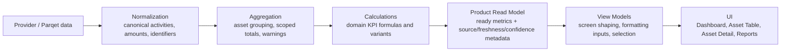

# PRM Field Lineage

Status: target lineage documentation for the first 20 Core KPIs  
Linked issues: Refs #402, Refs #405

## PRM in simple terms

The Product Read Model (PRM) is the app's prepared data layer for product screens.
It should take provider data plus app calculations and expose ready-to-display metrics with clear metadata.
That metadata should explain where a value came from, how fresh it is, how confident the app is, and whether anything is blocked.

In plain language: PRM is the version of the data that the UI should read, instead of each screen inventing its own financial math.

## Target architecture flow

## Boundary rules

### Calculations belong in domain modules

Financial formulas should live in calculation or domain modules such as `src/lib/calculations`.
That includes quantity, cost basis, valuation, realized/unrealized PnL, return denominators and KPI variants.

The reason is simple: one formula should have one owner.
If Dashboard, Asset Table and Asset Detail each re-create the same KPI differently, drift is almost guaranteed.

### PRM should expose ready metrics plus metadata

PRM should not be a raw provider dump.
It should expose the metric value and the metadata needed to trust or question that value.

Target PRM metadata for KPI surfaces includes:

- source type
- scope state
- freshness state
- confidence level
- blocked metrics
- value classification
- selected variant where relevant

### View models and UI should stay thin

View models may select which KPI to show and how to format it.
UI components may render, sort, filter and explain a KPI.
Neither layer should define independent financial formulas.

## What Field Lineage means

Field Lineage describes the path from raw input to displayed KPI.
For each KPI, it answers five questions:

1. Which upstream inputs are required?
2. Which layer owns the calculation?
3. Which metadata explains confidence, freshness and scope?
4. Which PRM field should downstream screens read?
5. Which known blockers or gaps still prevent full correctness?

This keeps future KPI fixes anchored to a documented target instead of local screen behavior.

## Current known risk to preserve

Current market-value paths still risk using `latestTradePrice` as an implicit fallback when a true market-price overlay is missing.
That is acceptable as a temporary runtime fallback only when a variant explicitly allows it.
It is not the target default lineage for `portfolio_value`, `position_value` or `unrealized_pnl`.

## Core KPI target lineage

| KPI | Stable key | Upstream inputs | Canonical owner | Target PRM exposure | Current gap / note |
| --- | --- | --- | --- | --- | --- |
| Portfolio Value | `portfolio_value` | `net_shares`, current market price, asset status, selected portfolios | `calculations` | Portfolio-level money metric with price-source metadata | Current aggregation does not require a market-price overlay before valuation. |
| Position Value | `position_value` | `net_shares`, current market price | `calculations` | Asset-level money metric | Same market-price fallback risk as portfolio value. |
| Net Shares | `net_shares` | Normalized buy/sell/deposit/withdrawal/transfer quantities, overrides | `calculations` | Asset quantity metric + blocked/confidence metadata | Negative quantity handling exists, but SecurityLineage continuity is future work. |
| Remaining Cost Basis | `remaining_cost_basis` | Acquisition amounts, sell-like removals, quantity history | `calculations` | Asset money metric | Tax-lot and cross-security carry-forward variants are not yet modeled. |
| Average Buy Price | `average_buy_price` | `remaining_cost_basis`, `net_shares` | `calculations` | Asset money metric + variant metadata | Exists as helper logic, but not as a first-class PRM KPI contract. |
| Unrealized PnL | `unrealized_pnl` | `position_value`, `remaining_cost_basis` | `calculations` | Asset and portfolio money metric | Correctness still depends on valuation input quality. |
| Unrealized Return % | `unrealized_return_pct` | `unrealized_pnl`, denominator policy | `calculations` | Percentage metric + denominator metadata | Denominator policy is not yet configurable. |
| Total Dividend Net | `total_dividend_net` | Dividend `amountNet`, fallback policy, period selection | `aggregation` | Money metric at asset, portfolio and report scope | Mixed-currency scopes still block safe totals. |
| Total Dividend Gross | `total_dividend_gross` | Dividend gross amount, period selection | `aggregation` | Money metric + gross/net lineage marker | Not yet exposed as a first-class PRM metric. |
| Total Fees | `total_fees` | Normalized fee amounts | `aggregation` | Money metric | PRM field exists, but surface coverage is incomplete. |
| Total Taxes | `total_taxes` | Normalized tax amounts | `aggregation` | Money metric | PRM field exists, but surface coverage is incomplete. |
| Total PnL | `total_pnl` | Realized PnL, unrealized PnL, dividend net, fees, taxes | `calculations` | Money metric + selected variant metadata | Shared KPI does not exist yet. |
| Total Return % | `total_return_pct` | `total_pnl`, `invested_capital` | `calculations` | Percentage metric + numerator/denominator metadata | Variant semantics still need to be implemented. |
| Price Return % | `price_return_pct` | Realized/unrealized price components, denominator | `calculations` | Percentage metric + variant metadata | Not yet represented in PRM. |
| Income Return % | `income_return_pct` | Dividend total, denominator | `calculations` | Percentage metric + variant metadata | Gross-income path is not yet modeled. |
| Invested Capital | `invested_capital` | Remaining basis and denominator variant policy | `calculations` | Money metric + denominator metadata | Variant definition is intentionally documented before implementation. |
| Realized PnL | `realized_pnl` | Sell proceeds, removed cost basis, optional cost adjustments | `calculations` | Money metric | Normalization reads realized-gain hints, but the KPI is not yet complete PRM output. |
| Realized Return % | `realized_return_pct` | `realized_pnl`, realized basis removed | `calculations` | Percentage metric + denominator metadata | Denominator tracking is not yet exposed. |
| Cashflow Net | `cashflow_net` | Buys, sells, dividends, fees, taxes, deposits, withdrawals | `aggregation` | Money metric + sign-convention metadata | No shared PRM KPI exists yet. |
| Asset Count | `asset_count` | Aggregated asset identity, status, selected scope | `PRM` | Summary count metric + status rule metadata | PRM summary counts assets, but target variants are not yet formalized. |

## Lineage pattern by layer

### 1. Provider / Parqet data

Provider data is the raw source for:

- activities
- amounts
- quantities
- timestamps
- asset identifiers
- provider-side reference fields such as reported realized gains where available

These fields are inputs, not UI-ready KPIs.

### 2. Normalization

Normalization should translate raw provider payloads into canonical activity records with consistent meanings.
Examples:

- classify activities as buy, sell, dividend, fee/tax or transfer-like events
- normalize amount fields such as gross, net, fee and tax
- attach canonical asset identity
- attach warnings when required fields are missing or ambiguous

### 3. Aggregation

Aggregation should group normalized activities into asset-level and scoped portfolio structures.
It may also produce safe totals when the calculation is a simple scoped sum and no extra business policy is needed.

Typical aggregation outputs:

- grouped assets
- portfolio breakdowns
- summed dividend, fee and tax totals
- warnings about mixed currencies or missing scope

### 4. Calculations

Calculations should own KPI semantics.
This includes:

- quantity formulas
- cost-basis formulas
- valuation formulas
- realized and unrealized PnL
- return percentages
- denominator policies
- variant selection rules

This is the layer that turns grouped inputs into canonical KPI outputs.

### 5. Product Read Model

PRM should publish:

- the KPI value
- source type
- freshness state
- confidence level
- blocked metrics
- scope state
- selected variant where relevant

Target rule: the PRM field name should be what screens read, instead of screens rebuilding the KPI.

### 6. View models and UI

View models should map PRM into screen-specific shapes.
UI should explain and display metrics, not define them.

Examples:

- Dashboard Hero chooses which KPI cards to show
- Asset Table chooses which columns to show
- Asset Detail explains the selected KPI set
- Reports format the metrics for export or print

## SecurityLineage forward-compatibility

SecurityLineage is future work for economic positions that may span security replacements, mergers, symbol changes or migrations.

Target rule:

- KPI docs declare whether a metric is `supported`, `gated`, `blocked` or `not_applicable`.
- `gated` means the KPI is valid on a single current asset identity, but full cross-security continuity needs a later lineage layer.
- `blocked` means the KPI must not claim continuity until lineage exists.
- `supported` means the KPI can be safely shown without extra security-continuity logic for its default scope.

This documentation intentionally does not implement `SecurityLineage`, but it keeps room for it so the KPI contract does not need to be rewritten later.

## KPI Settings forward-compatibility

Issue [#405](https://github.com/AdrianR98/parqet-app/issues/405) tracks settings-driven KPI selection and KPI variants.

Target rule:

- KPI semantics live here first.
- Settings choose among documented variants.
- PRM exposes which variant produced the value.
- UI explains the selected variant instead of inventing local fallback math.

This keeps settings additive.
The settings issue should not redefine KPI meaning; it should select from this catalog.

## Practical guidance for future implementation

- Add or refine formulas in `src/lib/calculations` or later domain-calculation modules.
- Use aggregation for grouping, scoping and simple safe sums.
- Extend PRM so KPI values and metadata travel together.
- Keep view-model formatting separate from business formulas.
- Treat runtime fallback values as temporary comparison input, not long-term truth.
