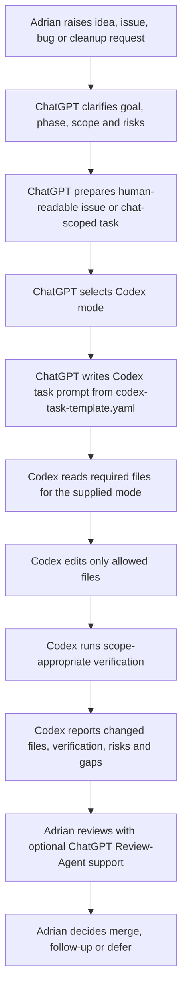
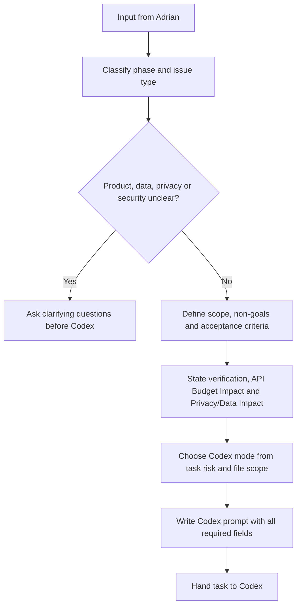
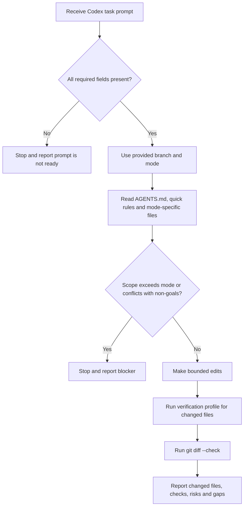
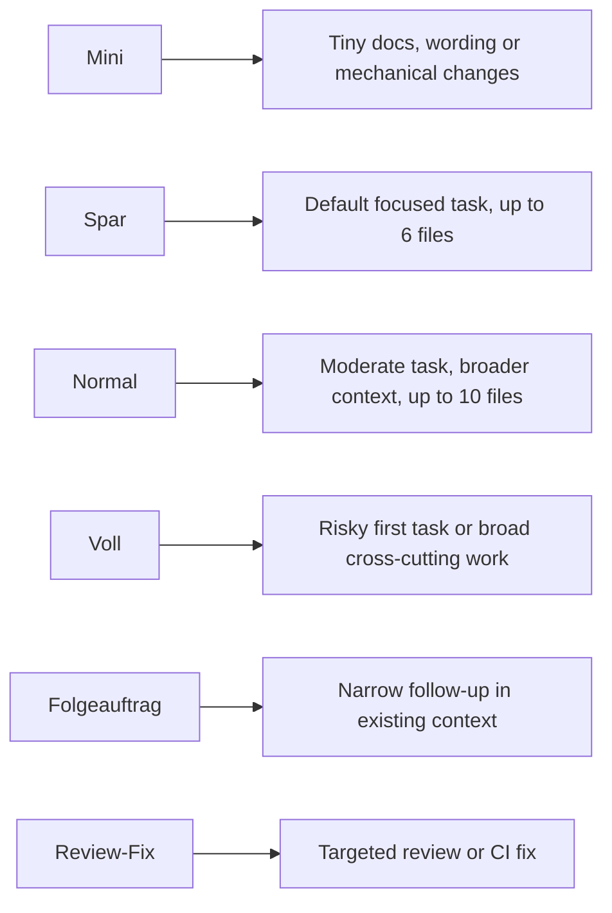

# Prompt Workflow

This directory contains the repository workflow prompts and task rules. `prompts/master-prompt.yaml` is shared project and agent guidance, not a ChatGPT-only prompt. Mode selection belongs to ChatGPT when it prepares a Codex task; Codex follows the supplied mode and does not choose or upgrade it. Codex never creates pull requests.

## Overall Workflow

## Issue Intake By ChatGPT

ChatGPT may act as Product-Agent, Architecture-Agent, Docs-Agent or Review-Agent during an active chat. It does not give Codex open-ended authority: the task prompt must define mode, branch, allowed changes, non-goals and verification.

## Codex Execution Flow

Codex may create local branch changes when the task gives a branch and allowed changes. Codex does not create PRs, close issues, set GitHub metadata, merge or widen scope.

## Mode Overview

Use `Voll` for risky first tasks touching auth/OAuth, tokens/cookies, Parqet API contracts, data pipeline, persistence, caching, security, Branch Protection or large refactors. Use at least `Normal` for medium governance updates, scripts, package changes, workflow changes or new test setup.

## Mode-Specific Read Sets

```mermaid
flowchart TD
    A["Mini"] --> A1["AGENTS.md"]
    A --> A2["Explicitly named files"]

    B["Spar"] --> B1["AGENTS.md"]
    B --> B2["prompts/codex-quick-rules.yaml"]
    B --> B3["Relevant files only"]

    C["Normal"] --> C1["AGENTS.md"]
    C --> C2["prompts/codex-quick-rules.yaml"]
    C --> C3["prompts/codex-task-template.yaml"]
    C --> C4["prompts/codex-execution-rules.yaml"]
    C --> C5["Relevant files selected with targeted search"]

    D["Voll"] --> D1["AGENTS.md"]
    D --> D2["prompts/master-prompt.yaml"]
    D --> D3["prompts/codex-quick-rules.yaml"]
    D --> D4["prompts/codex-task-template.yaml"]
    D --> D5["prompts/codex-execution-rules.yaml"]
    D --> D6["prompts/workflow-chatgpt-codex.yaml"]
    D --> D7["docs/DEVELOPMENT_WORKFLOW.md"]
    D --> D8["docs/PROJECT_STATUS.md"]
    D --> D9["Relevant ADRs"]
```

These read sets are implementation context, not a complete merge gate. Review and merge checks may require additional documents from `docs/DEVELOPMENT_WORKFLOW.md`, `docs/V1_GUARDRAILS.md`, ADRs or issue-specific references.
